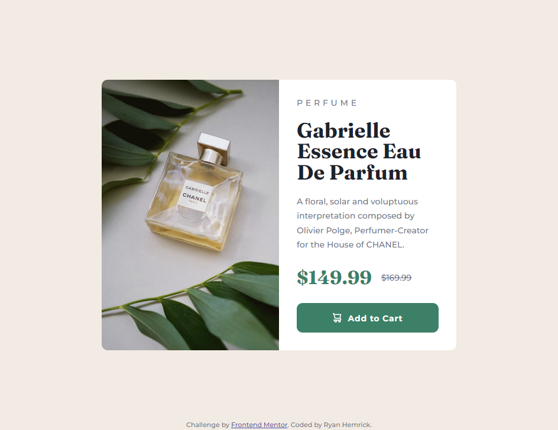

# Frontend Mentor - Product preview card component solution
This is a solution to the [Product preview card component challenge on Frontend Mentor](https://www.frontendmentor.io/challenges/product-preview-card-component-GO7UmttRfa). Frontend Mentor challenges help you improve your coding skills by building realistic projects. 

## Table of contents
- [Overview](#overview)
  - [The challenge](#the-challenge)
  - [Screenshot](#screenshot)
  - [Links](#links)
- [My process](#my-process)
  - [Built with](#built-with)
  - [What I learned](#what-i-learned)
- [Author](#author)

## Overview
Used HTML & CSS to create a product preview card that matched the provided designs as closely as possible.

### The challenge
Users should be able to:
- View the optimal layout depending on their device's screen size
- See hover and focus states for interactive elements

### Screenshot

### Links
- Will add in link LATER

## My process
- Creating the product preview card component was my first HTML & CSS project in a fairly long time. I wanted to approach this project with a 'beginner' mindset and utilize existing knowledge and practice using FlexBox.
- Utilized FlexBox to create the layout. From there, I used basic CSS properties and values to make the component match the provided designs.
- Used media queries to adjust the layout and spacing for mobile devices

### Built with
- Semantic HTML5 markup
- Basic CSS with FlexBox
- No custom properties

### What I learned
- LATER

## Author
- Ryan Hemrick
